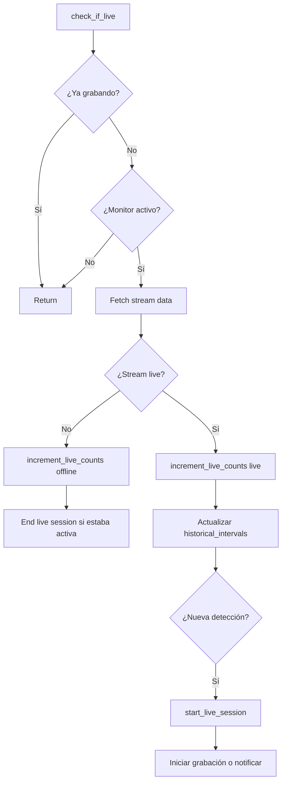

# Sistema de Inteligencia de StreamCap — Documentación Técnica

Este documento detalla el sistema completo de predicción, colas y detección temprana.
Cubre desde la recolección de datos históricos hasta cómo se decide cuándo y con qué frecuencia revisar cada streamer.

---

## 1. Arquitectura General

El sistema tiene cuatro capas que operan en conjunto:

```
┌──────────────────────────────────────────────────────────────┐
│                   CAPA DE PRESENTACIÓN                       │
│              LiveForecastDialog (UI predictiva)              │
└───────────────────────┬──────────────────────────────────────┘
                        │ consume
┌───────────────────────▼──────────────────────────────────────┐
│               CAPA DE PREDICCIÓN (HistoryManager)            │
│  likelihood_score · forecast_details · adjusted_interval    │
│  session_stats · cluster_hours · scheduled_windows          │
└───────────────────────┬──────────────────────────────────────┘
                        │ alimenta
┌───────────────────────▼──────────────────────────────────────┐
│           CAPA DE COLAS Y SCHEDULING (RecordingManager)      │
│  check_all_live_status · 3 priority queues · workers        │
│  adjusted_interval → dispatch → semaphore → fetch           │
└───────────────────────┬──────────────────────────────────────┘
                        │ ejecuta
┌───────────────────────▼──────────────────────────────────────┐
│           CAPA DE DETECCIÓN (check_if_live)                  │
│  fetch_stream · live_sessions · increment_live_counts       │
│  predictor_metrics · split_stale_session                    │
└──────────────────────────────────────────────────────────────┘
```

---

## 2. Capa de Datos — Recolección

### 2.1 `historical_intervals` (Seguimiento por hora)

Cada vez que se detecta un streamer en vivo, `increment_live_counts(is_live=True)` registra la hora actual en `historical_intervals[day_str]`:

```python
# recording_model.py — increment_live_counts()
self.historical_intervals[day_str].append(hour)
if len(self.historical_intervals[day_str]) > 5:
    self.historical_intervals[day_str].pop(0)
```

- **Clave**: día de la semana (`"0"` = lunes ... `"6"` = domingo).
- **Valor**: hasta 5 horas distintas (FIFO — la más antigua se descarta al llegar a 5).
- **Propósito**: Detectar cambios de horario. Si un streamer se mueve de las 21h a las 22h, las 21h se descartan solas tras 5 detecciones sin repetir.

### 2.2 `live_sessions` (Seguimiento por sesión)

Cada sesión de directo se registra con precisión de minuto:

```python
# recording_model.py — start_live_session()
self.live_sessions.append({
    "start_time": "2026-05-08T20:15:00",
    "end_time": "2026-05-08T22:45:00",
    "duration_minutes": 150,
    "weekday": 4,
    "start_hour": 20,
    "platform": "chaturbate",
    "was_scheduled": False,
    "scheduled_delay_minutes": None,  # minutos de retraso vs horario programado
})
```

- Límite: 120 sesiones por streamer (`LIVE_SESSION_LIMIT`).
- Si un streamer lleva más de 15 min sin ser detectado, la sesión se parte automáticamente (`split_stale_live_session_if_needed`).
- Las sesiones anteriores a 90 días se ignoran en los cálculos.

### 2.3 `priority_score` (EMA — Exponencial)

La prioridad se actualiza con Media Móvil Exponencial:

```python
alpha = 0.1 si está live, 0.005 si está offline
priority_score = priority_score * (1 - alpha) + (current_val * alpha)
# current_val = 1.0 si live, 0.0 si offline
```

- **Streamers activos**: la prioridad sube rápido y baja lento.
- **Inactividad prolongada**: si no se ve live en >30 días, se aplica decaimiento extra (1% por día adicional, máximo 60 días).

### 2.4 `consistency_score` (Densidad de patrón)

Mide qué tan lleno está el histograma de 5 slots por día:

```python
consistency_score = total_slots / (num_days * 5.0)
```

- 1.0 → el streamer tiene 5 registros en cada día activo (patrón muy consistente).
- 0.2 → solo 1 de 5 slots ocupado (patrón errático).

### 2.5 Predictor Metrics (Instrumentación)

El `PredictorMetricsStore` registra cada evento de dispatch y resultado en un archivo JSONL:

```
config/predictor_metrics.jsonl
```

**Eventos**:
| Evento | Momento | Payload |
|--------|---------|---------|
| `check_dispatched` | Cuando un streamer se encola | rec_id, priority, likelihood, loop_time_seconds, is_favorite |
| `check_result` | Cuando termina la verificación | rec_id, is_live, was_live, loop_time_seconds, detection_latency_seconds, dispatch_wait_seconds, likelihood_at_dispatch |

**Nuevos campos en `check_result`** (desde 2026-05-09):
- `dispatch_wait_seconds`: segundos desde que se encoló hasta que terminó el check. Expone congestión de colas.
- `likelihood_at_dispatch`: la likelihood que el predictor asignó en el dispatch anterior. Permite calibrar la precisión del predictor.

El reporte de métricas se genera con `scripts/predictor_metrics_report.py`:
```bash
# Reporte estándar (JSON, últimos 72h)
python scripts/predictor_metrics_report.py

# Reporte legible (incluye percentiles, breakdown F/M/S, likelihood por cola)
python scripts/predictor_metrics_report.py --human

# Comparar contra backup histórico
python scripts/predictor_metrics_report.py --metrics-file predictor_metrics_2026-05-09_backup.jsonl --human
```

---

## 3. Capa de Predicción — HistoryManager

### 3.1 `get_likelihood_score()` → La Probabilidad

Es el corazón del sistema. Combina múltiples señales en un score de 0.0 a 1.0:

```
score = 0.15 (baseline mínimo)
  + historical_intervals (proximidad a hora conocida)
  + _session_stats (análisis de sesiones reales)
  + confidence_boost (cantidad de sesiones)
  + consistency_score * 0.12
  + priority_score * 0.12
  - penalización por inactividad (>14 días → ×0.82, >45 días → ×0.70)
```

#### Paso 1: Historical Intervals (hora conocida más cercana)

```python
nearest_hour = min(active_hours, key=distancia_a_hora_actual)
proximity = max(0.0, 1.0 - (distancia / 180.0))  # 180 min = 3h de influencia
score = max(0.15, 0.25 + proximity * 0.55)
```

- Si la hora actual está muy cerca de una hora conocida → score hasta ~0.80.
- La ventana se acota mediante **clustering**: las horas registradas se agrupan en clusters con gap máximo de 4h. Se usa solo el cluster más cercano a la hora actual para la ventana, evitando rangos irreales.

#### Paso 2: Session Stats (sesiones reales)

```python
# Para cada sesión en los últimos 90 días:
weight = 1.0 / (1.0 + (age_days / 21.0))  # peso por antigüedad
day_weight = weight * (1.25 si mismo día, 0.35 si otro día)
proximity = max(0.0, 1.0 - (distancia_minutos / 240.0))

session_score = weighted_hits / weighted_total
session_component = 0.20 + session_score * 0.65
```

Además, produce una ventana precisa (minuto-grano) usando:
- `nearest_minute`: la sesión más cercana a la hora actual que coincide con el día de la semana.
- `avg_duration`: duración media de todas las sesiones.
- Ventana: `[nearest_start - nearest_start + avg_duration]`.

**Regla de resolución**: Si `session_component > score`, gana el score de sesiones. Pero la ventana y el próximo slot **siempre** se toman de `_session_stats` cuando están disponibles, porque son inherentemente más precisos.

#### Paso 3: Scheduled Windows (grabaciones programadas)

Si `scheduled_recording = True`, se analizan las ventanas programadas:

```python
for start_dt, end_dt in scheduled_windows:
    if now está dentro → score = 0.95, confidence = "high"
    if falta < 90 min → score = 0.70 + ((90 - minutes_until) / 90) * 0.15
```

#### Paso 4: Ajustes finales

- Si `score >= 0.75` → `confidence = "high"`
- Si `score >= 0.45` y no es high → `confidence = "medium"`
- Si el streamer lleva >14 días sin verse → score × 0.82
- Si lleva >45 días → score × 0.70
- Score mínimo: 0.05, máximo: 1.0

### 3.2 Horizon Forecasting (15/30/60 min)

Para cada streamer, el forecast simula cómo sería el score en 15, 30 y 60 minutos:

```python
horizons = {
    15: get_forecast_details(now + 15min)["score"],
    30: get_forecast_details(now + 30min)["score"],
    60: get_forecast_details(now + 60min)["score"],
}
```

Esto permite anticipar si la probabilidad va a subir o bajar en los próximos minutos (se muestra como tooltip en el diálogo de predicciones).

### 3.3 `get_adjusted_interval()` → Frecuencia de revisión

Traduce el score de probabilidad en un intervalo de revisión. **La likelihood siempre gana al deep sleep** —
si el predictor dice que un streamer tiene ≥50% de probabilidad de estar live, se revisa más rápido
aunque sea históricamente inactivo:

```python
likelihood = get_likelihood_score(recording)

if likelihood >= 0.9:
    target = 60                          # Fast: alta certeza, cada 60s
elif likelihood >= 0.5:
    target = base_interval // 2          # Medium: el predictor cree que puede estar live
elif priority_score < 0.01 y live_check_count > 30:
    target = base_interval * 3           # Deep Sleep: históricamente muerto Y baja likelihood
elif likelihood <= 0.15:
    target = int(base_interval * 1.5)    # Slow: muy improbable
else:
    target = base_interval               # Normal: sin señales claras
```

Luego se aplica **jitter del 15%** (valor aleatorio entre 85%-115%) para evitar patrones predecibles que las plataformas puedan detectar como bots.

Los **favoritos** nunca bajan de 180s, incluso si el score es bajo.

---

## 4. Capa de Colas y Scheduling

### 4.1 El ciclo principal: `check_all_live_status()`

Se ejecuta periódicamente (cada 180s por defecto) y procesa TODOS los streamers:

```
1. Ordenar por priority_score descendente (con random tiebreaker)
2. Para cada streamer:
   a. Calcular likelihood_score
   b. Calcular adjusted_interval
   c. ¿Intervalo excedido? → encolar. ¿No? → skip.
   d. Asignar a cola según intervalo:
       ≤ 60s   → FAST   (1-2 workers, adaptativo)
       ≤ 180s  → MEDIUM (1-2 workers, adaptativo)
       > 180s  → SLOW   (1-2 workers, adaptativo)
3. Publicar resumen del ciclo en event_bus
```

### 4.2 Las 3 Colas Prioritarias (Workers Adaptativos)

Tres colas asíncronas independientes con **workers adaptativos** que escalan según demanda:

| Cola | Intervalo | Workers (base) | Workers (máx) | Scale-up threshold | Uso principal |
|------|-----------|----------------|---------------|--------------------|---------------|
| **Fast (F)** | ≤ 60s | 1 | 2 | ≥5 en cola | Streamers en ventana de emisión activa |
| **Medium (M)** | ≤ 180s | 1 | 2 | ≥8 en cola | Streamers con probabilidad media o favoritos |
| **Slow (S)** | > 180s | 1 | 2 | ≥5 en cola | Streamers fuera de horario o con baja actividad |

**Regla global**: solo UNA cola puede tener el worker extra (2 workers) a la vez. La cola más congestionada
recibe el boost. Esto evita exceder los límites de concurrencia de las plataformas (máximo 4 workers totales:
3 base + 1 boost).

Un monitor corre cada 15 segundos:
- **Scale up**: si una cola supera su threshold y ninguna otra tiene 2 workers → se añade un worker.
- **Reasignación**: si otra cola está más congestionada (≥2× profundidad), el boost se mueve.
- **Scale down**: si una cola está vacía por 60 segundos, el worker extra se elimina.

Las colas evitan que streamers lentos bloqueen a los que están en ventana de emisión.

### 4.3 Workers y Semáforos

Cada worker consume de su cola y ejecuta `check_if_live()` con protección por semáforo:

```python
semaphore = self.platform_semaphores[platform_key]  # por plataforma
async with semaphore:
    stream_info = await recorder.fetch_stream()
```

- **Stagger**: Cada request espera 0.5-3s aleatorios antes de adquirir el semáforo, distribuyendo la carga.
- **Semáforos por plataforma**: Evita saturar una misma plataforma con requests simultáneos (máx 3 por defecto).
- **Workers adaptativos**: El monitor `_monitor_queues()` ajusta el número de workers en tiempo real. La concurrencia máxima total es de 4 workers (3 base + 1 boost), lo que combinado con el límite de 3 por plataforma mantiene el sistema dentro de márgenes seguros frente a protecciones antibot.

### 4.4 Summary del ciclo

Cada ciclo publica un resumen estructurado via `event_bus`:

```python
{
    "disp_fast": 3, "disp_medium": 12, "disp_slow": 25,   # encolados
    "busy_fast": 1, "busy_medium": 2, "busy_slow": 0,     # ya en proceso
    "waiting": 5,                                          # skip por intervalo no vencido
}
```

Esto se loguea y se puede consumir desde la UI para dashboards en tiempo real.

---

## 5. Capa de Detección

### 5.1 `check_if_live()` — Detección individual



**Detección temprana**: Cuando un streamer está en cola Fast (score ≥ 0.9), se revisa cada ~60s. La latencia de detección se calcula como:

```python
detection_latency = tiempo_actual - último_check_offline
```

Esto permite medir cuánto tardamos en detectar el inicio tras la ventana de alta probabilidad.

### 5.2 Live Sessions Management

- **`start_live_session()`**: Crea una sesión con timestamp exacto y calcula el retraso si hay horario programado.
- **`end_live_session()`**: Cierra la sesión con timestamp exacto y calcula duración.
- **`split_stale_live_session_if_needed()`**: Si un streamer estuvo "visto por última vez" hace >15 min pero la sesión sigue abierta, la cierra y permite empezar una nueva (evita sesiones zombies).

### 5.3 `check_if_live_with_retry()` — Recuperación

Para streams que terminan abruptamente y podrían reiniciarse:

```
1. check_if_live normal
2. Si no se detecta live → esperar 20s → reintentar (hasta 2 veces)
3. Si en algún intento se detecta → se retoma la grabación
```

---

## 6. Flujo Completo (Ejemplo Real)

Un streamer que suele emitir lunes a viernes ~20:00-23:00:

| Hora | Score | Cola | Intervalo | ¿Qué pasa? |
|------|-------|------|-----------|------------|
| 10:00 | 0.15 | Slow | 450s (7.5 min) | El sistema "descansa", revisión espaciada |
| 18:00 | 0.35 | Medium | 150s (2.5 min) | Se acerca la ventana, frecuencia media |
| 19:30 | 0.65 | Medium | 150s | Aumenta probabilidad |
| 19:55 | 0.92 | Fast | 60s (1 min) | Alta probabilidad, revisión intensiva |
| 20:02 | 1.00 | — | — | **Detectado live**. `start_live_session()` |
| 20:02 | — | — | — | Se inicia grabación |
| 23:15 | 0.70→0.15 | Slow | 450s | Terminó el directo, probabilidad cae |
| (días siguientes con datos) | | | | Las ventanas se afinan: `20:00-23:00` |

---

## 7. Configuración Relevante

| Clave | Default | Efecto |
|-------|---------|--------|
| `loop_time_seconds` | 300 | Tiempo base de revisión (5 min) |
| `ema_alpha_active` | 0.1 | Velocidad de EMA cuando está live |
| `ema_alpha_offline` | 0.005 | Velocidad de EMA cuando está offline |
| `platform_max_concurrent_requests` | 3 | Máximo de requests simultáneos por plataforma |
| `max_gap_hours` (hardcode) | 4 | Gap máximo para clustering de horas |

---

## 8. Diagrama de Clases (Core)

```
RecordingModel
├── historical_intervals: dict[str, list[int]]   # día → [horas]
├── live_sessions: list[dict]                    # sesiones precisas
├── priority_score: float                        # EMA
├── consistency_score: float                     # densidad de patrón
├── increment_live_counts(is_live)
├── start_live_session()
├── end_live_session()
└── split_stale_live_session_if_needed()

HistoryManager (static)
├── get_likelihood_score(recording) → float
├── get_forecast_details(recording) → dict       # score, confidence, window, horizons
├── get_adjusted_interval(recording, base) → int
├── _session_stats(recording, now) → dict
├── _cluster_hours(hours) → list[list[int]]
└── _parse_scheduled_windows(recording, now) → list[tuple]

RecordingManager
├── check_all_live_status()                      # ciclo principal
├── check_if_live(recording)                     # detección individual
├── _queue_fast / _queue_medium / _queue_slow    # colas prioritarias
├── platform_semaphores                          # control de concurrencia
└── predictor_metrics: PredictorMetricsStore     # instrumentación

PredictorMetricsStore
├── record_event(event_type, payload)
└── summarize(lookback_hours) → MetricsSummary
```

---

## 9. Cambios Recientes

| Fecha | Cambio | Motivo |
|-------|--------|--------|
| 2026-05-10 | Fix: `next_slot_text` prefiere sesiones/horas futuras | A las 23:10 mostraba "Próximo: 20:38" (pasado) en vez de la siguiente ventana |
| 2026-05-10 | Workers adaptativos con límite global (solo 1 cola boosted) | Evitar >4 workers concurrentes → no disparar antibot |
| 2026-05-10 | Fix: likelihood gana al deep sleep en `get_adjusted_interval()` | Streams 100% likelihood caían en Slow por ser históricamente inactivos |
| 2026-05-09 | Percentiles (p50/p95/p99) y `dispatch_wait_seconds` en métricas | El promedio escondía cola larga; p95=570s reveló congestión estructural |
| 2026-05-09 | Breakdown F/M/S y `likelihood_at_dispatch` en reporte | Visibilidad de distribución de carga y calibración del predictor |
| 2026-05-09 | `--human` y `--metrics-file` en predictor_metrics_report.py | Reporte legible y comparación contra backups |
| 2026-05-08 | Clustering de `historical_intervals` | Evitar ventanas `00:00-22:00` con solo 5 slots dispersos |
| 2026-05-08 | Desacople ventana de `_session_stats` del score | Usar ventana precisa (minuto-grano) siempre que haya datos de sesión |
| 2026-05-03 | FIFO-5 por día en `historical_intervals` | Detectar cambios de horario rápidamente |
| 2026-05-03 | Restauración de predictor metrics | Recuperar instrumentación perdida |
| 2026-04-27 | Prioridad por EMA + colas asíncronas | Evitar bloqueos y optimizar detección temprana |
